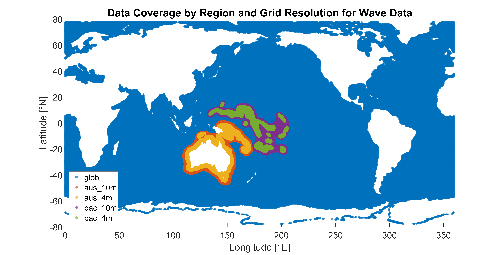
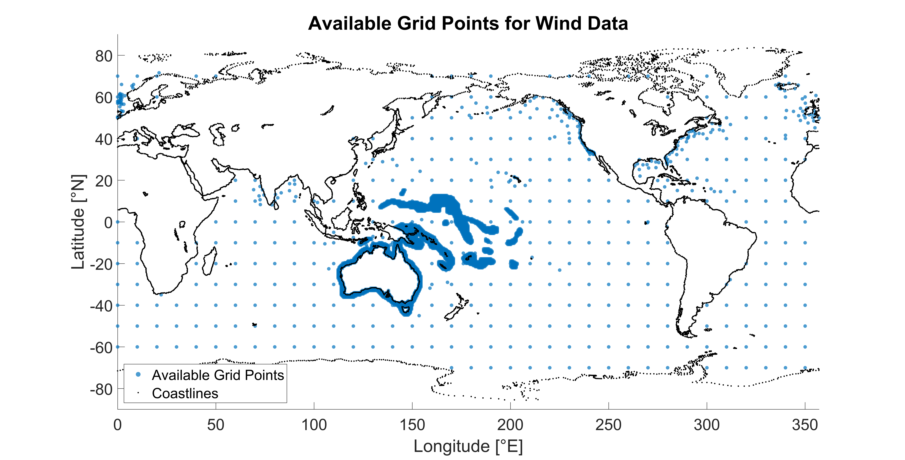

# Function and Parameter Reference

This page documents function signatures, arguments, defaults, outputs, variables, and dataset coverage.

For step‑by‑step workflows and examples, see [Usage Guide](usage.md).

## 1. `loadWaveData`

### 1.1 Function signature

```matlab
[wave_data, dataset_metadata] = loadWaveData(target_lon,target_lat, start_year_month, end_year_month, ...
    "region", region, ...
    "resolution", resolution, ...
    "verbose", verbose, ...
    "cache", cache, ...
    "params", params, ...
    "wind", false);
```

### 1.2 Description

This function loads [CAWCR Wave Hindcast](https://researchdata.edu.au/cawcr-wave-hindcast-aggregated-collection/1401722#:~:text=Organisation%26rft,4%20degree%20%2824%20arcminute) data for a specified location and time range. It supports the optional inclusion of additional variables and caching to reduce repeated downloads.

Wave and wind data are stored in different catalogues in CAWCR; the function can retrieved only one catalogue per call:

- Wave data: retrieved from the `gridded` catalogue
- Wind data: retrieved from the `spec` catalogue

### 1.3 Arguments for loading wave data

| Parameter          | Type       | Default | Description                                  |
| ------------------ | ---------- | ------- | -------------------------------------------- |
| `target_lon`       | numeric    | —       | Target longitude [degrees E]                 |
| `target_lat`       | numeric    | —       | Target latitude [degrees N]                  |
| `start_year_month` | numeric    | —       | Start date in `YYYYMM`                       |
| `end_year_month`   | numeric    | —       | End date in `YYYYMM`                         |
| `region`           | string     | `aus`   | Data region: `aus`, `glob`, `pac`            |
| `resolution`       | numeric    | `10`    | Grid resolution [arcminutes]                 |
| `verbose`          | logical    | `true`  | Display progress messages                    |
| `cache`            | logical    | `true`  | Save monthly data during loading             |
| `params`           | cell array | `{}`    | Extra variables to load (e.g., `t0m1`, `fp`) |
| `wind`             | logical    | `false` | Retrieved `gridded` catalogue                |

### 1.3.1 Regions, resolutions, coverage for wave data

| Code   | Description       | Grid resolution (arcmin) | Temporal Coverage |
| ------ | ----------------- | ------------------------ | ----------------- |
| `glob` | Global domain     | 24                       | 197901–present    |
| `aus`  | Australian region | 10, 4                    | 197901–present    |
| `pac`  | Western Pacific   | 10, 4                    | 197901–present    |

> Check latest monthly availability at the [`gridded`](https://data-cbr.csiro.au/thredds/catalog/catch_all/CMAR_CAWCR-Wave_archive/CAWCR_Wave_Hindcast_aggregate/gridded/catalog.html) catalogue.



### 1.4 Arguments for loading wind data

| Parameter          | Type       | Default | Description                      |
| ------------------ | ---------- | ------- | -------------------------------- |
| `target_lon`       | numeric    | —       | Target longitude [degrees E]     |
| `target_lat`       | numeric    | —       | Target latitude [degrees N]      |
| `start_year_month` | numeric    | —       | Start date in `YYYYMM`           |
| `end_year_month`   | numeric    | —       | End date in `YYYYMM`             |
| `verbose`          | logical    | `true`  | Display progress messages        |
| `cache`            | logical    | `true`  | Save monthly data during loading |
| `params`           | cell array | `{}`    | Extra variables to load          |
| `wind`             | logical    | `true`  | Retrieved `spec` catalogue       |

> Check latest monthly availability at the [`spec`](https://data-cbr.csiro.au/thredds/catalog/catch_all/CMAR_CAWCR-Wave_archive/CAWCR_Wave_Hindcast_aggregate/spec/catalog.html) catalogue.



### 1.5 Outputs

_Note: `wave_data` or `wind_data` is saved to the `outputs/` data retrieval location folder as both .mat and .csv files; `dataset_metadata` is included only in the .mat file._

- **wave_data** - Table containing time series wave parameters with columns:
  - `time`: time vector
  - `t02`: spectral density second frequency moment [s]
  - `hs`: significant wave height [m]
  - `dir`: wave from direction [degrees]
  - Additional columns if specified in `params` input (e.g., `t0m1`, `fp`, `dpm`)
- **wind_data** - Table containing time series wave parameters with columns:
  - `time`: time vector
  - `wnd`: wind speed at 10m [m/s]
  - `wnddir`: wind from direction [degrees]
  - Additional columns if specified in `params` input
- **dataset_metadata** - Structure with extraction location info and processing metadata:
  - `target_lon` - Target longitude requested [degrees E]
  - `target_lat` - Target latitude requested [degrees N]
  - `actual_lon` - Actual longitude of nearest grid point [degrees E]
  - `actual_lat` - Actual latitude of nearest grid point [degrees N]
  - `location_offset` - Distance between target and actual location [km]
  - `start_year_month` - Start date in YYYYMM format
  - `end_year_month` - End date in YYYYMM format
  - `additional_params` - Cell array of additional parameters loaded
  - `idx` - Index used for data extraction
  - `filename` - Folder name/ file name for saving the dataset
  - Only for wave data:
    - `region` - Dataset region ('aus', 'glob', or 'pac')
    - `grid_resolution` - Grid resolution [arcminutes]

## 2. `waveHindcastAnalysis`

### 2.1 Function signature

```matlab
waveHindcastAnalysis(x_param, y_param, dataset_metadata, ...
    "bins", 15, ...
    "save_fig", true, ...
    "text", true, ...
    "xlabel", "X-axis Label", ...
    "ylabel", "Y-axis Label", ...
    "rootName","Root name for the saved figure");
```

### 2.2 Description

Create a bi‑variate probability distribution heatmap from paired series.

### 2.3 Arguments

| Parameter          | Type      | Default                             | Description                                     |
| ------------------ | --------- | ----------------------------------- | ----------------------------------------------- |
| `x_param`          | numeric   | —                                   | First parameter (plotted on x-axis)             |
| `y_param`          | numeric   | —                                   | Second parameter (plotted on y-axis)            |
| `dataset_metadata` | structure | —                                   | Dataset information from `loadWaveData`         |
| `bins`             | numeric   | `15`                                | Number of bins for each dimension               |
| `save_fig`         | logical   | `true`                              | Save figure to PNG file                         |
| `text`             | logical   | `true`                              | Display percentage values on heatmap            |
| `xlabel`           | string    | `"Period T_{02} [s]"`               | X-axis label                                    |
| `ylabel`           | string    | `"Significant Wave Height H_s [m]"` | Y-axis label                                    |
| `rootName`         | string    | `{}`                                | Define a custom root name for saving the figure |
