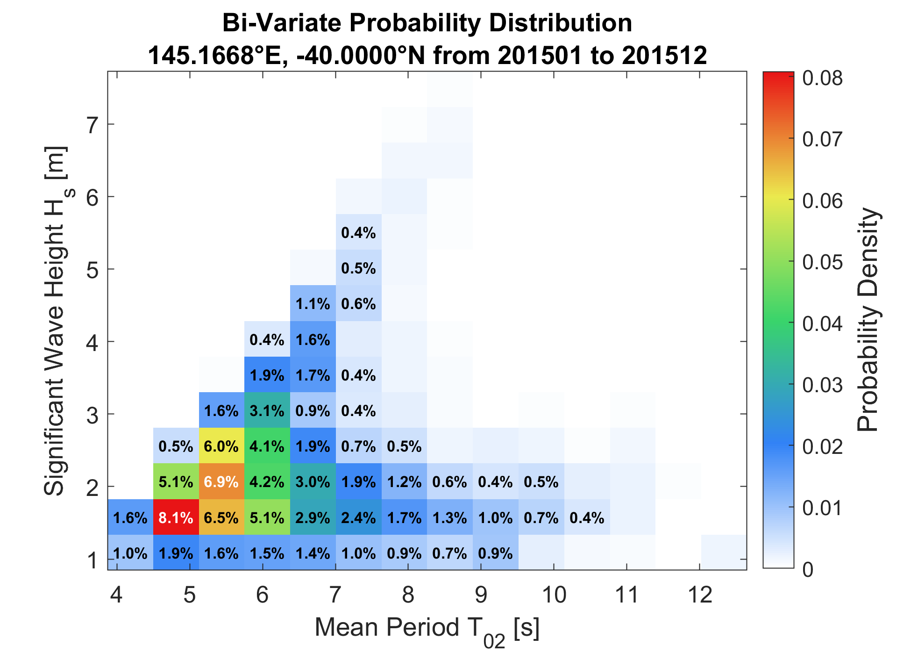
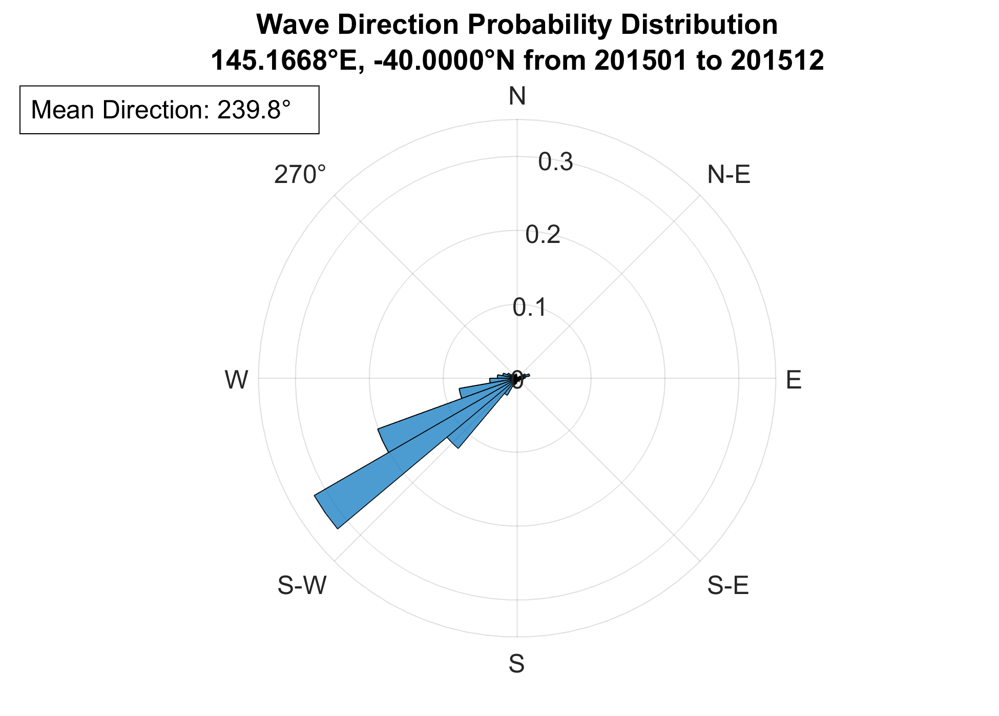

# Usage Guide

This guide shows typical workflows and runnable examples for the toolbox.

For complete argument definitions, defaults, and output fields, see [Function and Parameter Reference](parameters.md).

## Overview

**Typical workflow**

1. Choose a location and time range.
2. Load wave data with `loadWaveData`.
3. (Optional) Tune binning or use helper utilities for analysis and caching.
4. Use the downloaded `wave_data` or generated figures.

## 1. `loadWaveData` function

### 1.1 Basic loading for wave data

```matlab
[wave_data, dataset_metadata] = loadWaveData(145.1768, -40.026, 201501, 201512);
```

### 1.2 Advanced full options for loading wave data

```matlab
[wave_data, dataset_metadata] = loadWaveData(145.1768, -40.026, 201501, 201512, ...
    'region', 'aus', ...            % 'aus' | 'glob' | 'pac'
    'resolution', 4, ...            % arcminutes
    'radius', 0.5, ...              % degrees
    'params', {'t0m1','fp','dpm'}, ... % additional params to load
    'cache', false, ...             % monthly caching
    'verbose', false);              % display messages
```

### 1.3 Basic loading for wind data

```matlab
[wave_data, dataset_metadata] = loadWaveData(145.1768, -40.026, 201501, 201512, 'wind', true);
```

### 1.4 Advanced full options for loading wave data

```matlab
[wave_data, dataset_metadata] = loadWaveData(145.1768, -40.026, 201501, 201512, ...
    'wind', true, ...
    'params', {'t0m1','fp','dpm'}, ... % additional params to load
    'cache', false, ...             % monthly caching
    'verbose', false);              % display messages
```

#### 1.5 Exploring available parameters for `params`

Inspect available variables directly from the remote NetCDF catalogue:

```matlab
% For gridded datasets (wave)
url = 'https://data-cbr.csiro.au/thredds/dodsC/catch_all/CMAR_CAWCR-Wave_archive/CAWCR_Wave_Hindcast_aggregate/gridded/ww3.aus_4m.202508.nc';
info = ncinfo(url); {info.Variables.Name}' % list parameter names

% For spec datasets (wind)
url = 'https://data-cbr.csiro.au/thredds/dodsC/catch_all/CMAR_CAWCR-Wave_archive/CAWCR_Wave_Hindcast_aggregate/spec/ww3.202508_spec.nc';
info = ncinfo(url); {info.Variables.Name}' % list parameter names
```

### 1.6 Outputs

- `wave_data` or `wind_data`: table of time‑series variables suitable for plotting and statistics
- `dataset_metadata`: struct describing extraction and processing

## 2. Analysis functions

### 2.1 `waveHindcastAnalysis` function

Generate bi-variate probability distribution heatmaps

#### 2.1.1 Basic usage

```matlab
waveHindcastAnalysis(wave_data.t02, wave_data.hs, dataset_metadata);
```

#### 2.1.2 Advanced full options

```matlab
waveHindcastAnalysis(wave_data.t02, wave_data.hs, dataset_metadata, ...
    'bins', 20, ...               % No. of bins
    'save_fig', false, ...
    'text', false, ...            % Display percentage values
    'xlabel', 'X-axis Label', ...
    'ylabel', 'Y-axis Label');
```

### 2.2 `waveRose` function

Generate polar histogram (rose plot) for wave directions

```matlab
mean_dir = waveRose(wave_data.dir, dataset_metadata);

% Display only
waveRose(wave_data.dir, dataset_metadata, 'save_fig', false);

% Wind rose
waveRose(wind_data, dataset_metadata, 'title', 'Wind Direction');
```

### 2.3 Example outputs

<table>
<tr>
<td width="50%">

`waveHindcastAnalysis`


</td>
<td width="50%">

`waveRose`


</td>
</tr>
</table>

**See also**: [Function and Parameter Reference](parameters.md), [Troubleshooting Guide](troubleshooting.md), [Toolbox Structure](structure.md)
