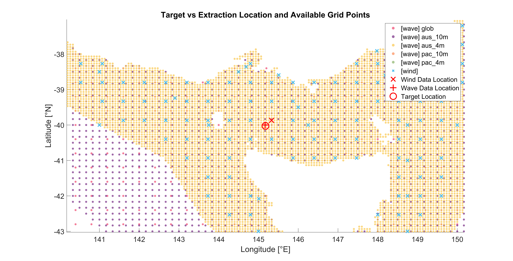

# Usage Guide

This guide shows typical workflows and runnable examples for the toolbox.

For complete argument definitions, defaults, and output fields, see [Function and Parameter Reference](parameters.md).

## 1. Typical workflow

1. Choose a location and time range
2. Select the region, resolution, or other function properties in `loadWaveData`
3. Check extraction location proximity
4. Use the downloaded data or generated figures

## 2. Basic Usage of `loadWaveData` function

### 2.1 Load wave data

```matlab
% Using function defaults, the region is "aus" and the resolution is "10"
[wave_data, dataset_metadata] = loadWaveData(145.1768, -40.026, 201501, 201512);
```

### 2.2 Load wind data

```matlab
[wave_data, dataset_metadata] = loadWaveData(145.1768, -40.026, 201501, 201512, 'wind', true);
```

### 2.3 Optional Settings

To customise behaviour, you may pass optional name-value pairs.
Common options for wave and wind loading include:

- `verbose`: show/hide progress messages
- `useParallel`: enable/disable parallel processing
- `params`: load additional variables

_Example: Load wave data with custom settings_

```matlab
[wave_data, dataset_metadata] = loadWaveData(145.1768, -40.026, 201501, 201512, ...
    "region", "aus", ...            % "aus" | "glob" | "pac"
    "resolution", 4, ...            % arcminutes
    "params", {'t0m1','fp','dpm'}, ... % additional params to load
    "useParallel", false, ...       % sequential data loading
    "verbose", false);              % display messages
```

### 2.4 Outputs

- `wave_data` or `wind_data`: table of time‑series variables suitable for plotting and statistics
- `dataset_metadata`: struct describing extraction and processing
- Saved monthly data

## 3. Analysis Tools

### 3.1 `waveHindcastAnalysis`

Generate bi-variate probability distribution heatmaps.

#### 3.1.1 Basic usage

```matlab
waveHindcastAnalysis(wave_data.t02, wave_data.hs, dataset_metadata);
```

#### 3.1.2 Advanced full options

```matlab
waveHindcastAnalysis(wave_data.t02, wave_data.hs, dataset_metadata, ...
    "bins", 20, ...               % No. of bins
    "save_fig", false, ...
    "text", false, ...            % Display percentage values
    "xlabel", "X-axis Label", ...
    "ylabel", "Y-axis Label", ...
    "rootName","bassStraight");   % Saved figure names will begin with 'bassStraight'
```

### 3.2 `waveRose`

Generate polar histogram (rose plot) showing the joint probability distribution of wave (or wind/current) directions and heights (or speeds).

```matlab
% Basic usage
mean_dir = waveRose(wave_data.dir, wave_data.hs, dataset_metadata);

% Advanced full options for using it as wave rose
waveRose(wave_data.dir, wave_data.hs, dataset_metadata, ...
    "save_fig", false, ...
    "rootName","bassStraight");

% Wind rose
waveRose(wind_data.wnddir, wind_data.wnd, dataset_metadata, "title", "Wind");
```

### 3.3 Example outputs

<table>
<tr>
<td width="50%">

`waveHindcastAnalysis`


</td>
<td width="50%">

`waveRose`


</td>
</tr>
</table>

### 3.4 **`locationComparison`**

Visualise the actual grid point used for data extraction versus your target location.

If the offset is large, adjust "region" or "resolution" in your next loadWaveData call.

```matlab
% With one extracted dataset_metadata (wave or wind)
locationComparison(dataset_metadata);

% With both wave and wind metadata
locationComparison(dataset_metadata);
```



**See also**: [Function and Parameter Reference](parameters.md), [Troubleshooting Guide](troubleshooting.md), [Toolbox Structure](structure.md)
